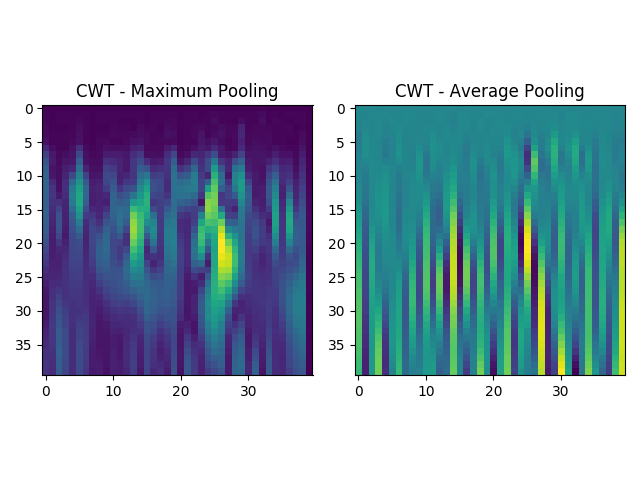

# CHOP-CICU
A project to apply image-based transfer learning on neonatal EEG recorded at Cardiac Intensive Care Units (CICU) at the Children's Hospital of Philadelphia to classify EEG background patterns and predict oncoming cardiac arrest.

Please refer to the following README to gain a better understanding of the project.

## Motivation
Forty-thousand neonates are born annually in the U.S. with congenital heart diseases (CHD), and 1% of these patients experience cardiac arrest [1]. With seizures occurring in many neonates after pediatric cardiac surgery, some hospitals have monitored their CHD patients’ EEG. From these recordings, a number of clinicians have hypothesized that EEG background patterns change preceding cardiac arrest [2]. These patterns include (but are not limited to) Normal Continuity (NC), Normal Discontinuity (ND), Continuous Low Voltage (CLV), Excessive Discontinuity (ED) and Low Voltage Suppression (LVS). Here, these five states are ordered with respect to increasing associativity with higher risk of oncoming cardiac arrest.

Although the EEG-based approach for monitoring CHD patients is increasingly being adopted by clinicians, this approach has the drawback of requiring clinicians to manually annotate the EEG recordings, resulting in an unwanted loss of time and resources for both the clinician and the affiliated medicial facility. Furthermore, it has been demonstrated that current methods for monitoring neonatal EEG recordings is not reliable to a satisfying degree - a recent study shows a poor quality of interrater agreements between discontinuity patterns within neonatal EEG [3]. This naturally calls for a quantitative method to distinguish EEG background patterns and predict cardiac arrest, reducing the dependence on clinicians' individual assessments and allowing for automated EEG analysis to run in real-time as the patients' EEG recordings are processed.

In this project, we apply deep learning to automate the process of EEG background identification and cardiac arrest prediction. The dataset is obtained from EEG recordings of 15 neonate patients at cardiac intensive care units at CHOP. Data extraction for the CHOP dataset is performed through IEEG, an online portal that shares electrophysiological data to foster collaboration between clinicians and scientists for epilepsy research [4]. A major obstacle to applying deep learning techiniques on medical data is the size of the available dataset - the number of samples is not enough to build a classifier with sufficient depth that is able to capture complex, subtle patterns that exist within the dataset. To solve this major problem that also exists within the CHOP dataset, we propose that inter-EEG transfer learning allows to generalize neonatal EEG analysis by sharing low-level pattern recognition across multiple different tasks.

## Transfer Learning
Transfer learning a technique that pre-trains a deep learning model upon a large dataset, and fine-tunes a subset of the model on the problem-specific dataset to enhance the model's performance when limitied data is available. This technique is often employed in the field of image recognition, where researchers often employ pre-trained deep convolutional neural networks on the famous ImageNet dataset and then fine-tuning the model on a smaller image dataset of interest [5]. Using this idea, we propose an inter-EEG transfer learning method where a deep learning model is trained upon a large, independent EEG dataset and fine-tuned on the specific EEG dataset of interest. More specifically, we first train a deep convolutional neural network (CNN) that learns to detect seizure traces within neonatal EEG from a dataset of 50 neonates in a neonatal intensive care unit (NICU). Then, we use the preconfigured model and only re-train the last several layers with the CHOP dataset to 1) detect backgrounds within neonatal EEG and 2) predict cardiac arrest onset.

The driving motivation behind this proposal is that different types of detection/classification problems for EEG must share common patterns in earlier, rudimentary stages even though they may differ in later stages that are geared towards the specific problem. This hypothesis can be tested by transferring parameters from one dataset to an independent EEG dataset. (Note that the two EEG datasets were both recorded with the NATUS device, thus mitigating hardware influence.) At the same time, one must note that neonatal EEG is significantly different from adult EEG and therefore a classifier must be trained specifically on neonatal EEG to effectively capture the underlying patterns within the signal of interest.

## Seizure Detection in Neonatal EEG
*The code for seizure detection in neonatal EEG is located in the folder NICU_EEG.*

The dataset for seizure detection of neonatal EEG is obtained from a free online database [6] as raw edf files. The contents from these files are loaded by **load_data.py**, and the artifacts are removed by **preprocess_data.py** to obtain relevant EEG recordings without noise. The latter file also performs feature/image extractions from the EEG recordings. In this project, all EEG recordings are split into non-overlapping 5 second segments for data analysis including artifact removal and feature extraction. EEG features incorporated into this project are: standard deviation, interquartile range, skewness, kurtosis, line length, bandpower in the delta/theta/alpha/beta frequency ranges. The numerical mean and standard deviation of these values are calculated over all EEG channels and used as input features for the deep learning model.

To obtain image features from a one-dimensional EEG signal, we use the continuous wavelet transform (CWT) to create a scaleogram that encodes the distribution of a specific EEG segment with respect to time and scale (inversely proportional to frequency), as implemented in **wave_features.py**. It has been shown that CWT often outperforms classical feature extraction for signals, as demonstrated by a paper that highlights improved earth fault detection by performing CWT on relevant signals [7]. Compared to other time-frequency analysis methods such as the Fast Fourier Transform (FFT) or Short-Time Fourier Transform (STFT), the CWT offers a richer depiction of the input signal by increasing temporal resolution in high-frequency domains and increasing frequency resolution in low-frequency domains. Since the raw scaleogram is too large for efficient processing, both max-pooling and average-pooling are employed to downsample the data and both outputs are used as different "channels" of a single image. Examples of such outputs are shown below:

Using the EEG-specific features along with the image data obtained using the CWT, we train a multi-input convolutional neural network that processes the two-channel images with multiple convolution/pooling operations and concatenates the normalized features into its fully connected layer to output whether the corresponding EEG segment represent seizure or not. The structure of the network is defined in **models.py** and the training procedure is detailed in **train_model.py**. Below is a diagram of the model that is used for detecting seizures. A training set of 40 patients is used, along with a validation set of 5 patients and testing set of 5 patients.

The outputs of the model is first processed so that seizure alerts are given for a continuous stream of EEG segments rather than intermittent alerts that the raw output returns. The model only returns seizure warnings when enough raw outputs exceeding a certain value are given within a fixed window frame. This method is implemented in **test_model.py**, along with a method that computes the precision, recall and f1 score of the model. A figure comparing the raw and processed outputs is shown below.

## EEG Background Classification
*The code is located in the folder CHOP_CICU.*

Having pre-trained a model for detecting seizures in neonatal EEG within NICU, we now focus our attention to applying transfer learning to train a model that can classify different EEG backgrounds. Due to the limited size of the available CHOP dataset, we reduce the labels to either NC/ND/CLV or ED/LVS so that each label has a sufficient number of samples. The three background stages within the first category indicate a low probability of impending cardiac arrest, while the two background stages within the second category indicate a higher corresponding risk.

The CHOP dataset is first extracted through MATLAB (accessing the IEEG portal requires authorization) and then loaded in **load_dataset.py**. For each patient, different background stages are annotated by their onsets, and 10 minutes of EEG recordings are extracted for each stage. The data is preprocessed in the same way as the NICU recordings, as shown in **preprocess_data.py** The preprocessed data is then trained on a convolutional neural network, with its structure defined in **models.py**. Refer to the diagram below to see how transfer learning is used from the seizure detection model.

The training process is completed using a cross-validation procedure to ensure that the model is tested on a patient that is unseen during the training phase. Observe that only the fully connected layers that are newly added to the transferred convolution/pooling layers are newly trained. During training, each 5-second EEG segment is matched with a binary label that indicates the corresponding background stage. The specific training parameters can be configured in **train_classifier.py**, which also contains a method that allows the user to evaluate the trained model for each patient. This file also contains an option to train and evaluate a baseline model, which is a neural network that has the same number of parameters but does not leverage transfer learning.

The performance of the classifier is evaluated by first sliding a larger window (default is 1 minute) over the entire set of predictions for the unseen patient. Within each window, the most frequent prediction/label is compared to compute test metrics. Consult **evaluate_model.py** for specific parameter options used during the testing procedure. The training curves and test metrics can be plotted in **visualize_model.py**, with some results depicted below.

From the plots above, one can observe that the transfer learning approach yields significantly improved results for several patients, but most patients do not benefit from the proposed methodology. Meanwhile, transfer learning does provide more promising results for obtaining satisfying test metrics for the NC/ND/CLV class, which is relatively underrepresented compared to the ED/LVS class within the training dataset.

## Cardiac Arrest Onset Prediction
*The code is located in the folder CHOP_CICU.*

A more interesting application of inter-EEG transfer learning in this project is prediction of imminent cardiac arrest. Similar to the background detection, using a pre-trained model can overcome the limitations imposed by the small size of the available CHOP dataset. The raw data stored in pickle files are loaded into the desired format in **load_dataset_pred.py**. Then, it is processed in the same way as dictated by **preprocess_data.py** and trained on a CNN as defined in **models.py**. A different model is used to suit the larger size of the dataset that is available for cardiac arrest prediction.

As done in the EEG background classification process, a model for cardiac arrest prediction is trained by feeding pre-processed EEG features/images into a pre-trained CNN and fine-tuning parameters in the last few layers to specifically suit the needs of cardiac arrest prediction via EEG analysis. Note that the training procedure is detailed within **train_classifier_pred.py**. Again, a cross-validation method is used to train each model on all patients except one and test the model on the excluded patient. Due to the large imbalance between EEG recordings within ~15 minutes of cardiac arrest and those that are not, training losses are weighted differently for the two class labels. The file contains an option to train a baseline model, which is a model that contains the same number of parameters but does not use transfer learning from the NICU seizure detection model.

Furthermore, a post-processing method is used to check the reliability of the model since the raw model outputs do not align well with real-life clinical needs of obtaining a consistent set of predictions for cardiac arrest. The post-processing scheme uses a windowing method, where only continuous model outputs above a certain threshold within a specified window frame are combined together to output a continuous alert for the test patient. The file **evaluate_model.py** contains methods for these needs, along with a method that returns test metrics for cardiac arrest prediction. Sample results are demonstrated below for several patients within the CHOP dataset, with the cardiac arrest onset occuring at the right-end of the graph as indicated by the red lines. On the left is the raw model output, while on the right is the postprocessed model output.

The false detection rates of the model is defined as each 15-minute segment that contains a post-processed output falsely predicting the presence of cardiac arrest. Overall, all models were able to detect the presence of cardiac arrest at least ~5 minutes before the actual cardiac arrest onset. It can be seen that models that have leveraged transfer learning generally outperform the baseline model, and that our model is able to predict cardiac arrest with no more than 1 false detection/hr for more than half of the patients.

## Discussion
The results that are obtained by the pipeline described above are not ideal. In fact, it is very difficult to perfectly demonstrate the applicability of a deep learning model when it must be cross-validated with a test patient that is completely hidden during the training process. Biological data tends to contain much fluctuating patterns due to hardware noise and patient-specific artifacts, making it very challenging to build a classifier that performs well on all patients. However, the usefulness of the transfer learning approach can be observed in some patients in the cardiac arrest prediction task, whereas the EEG background detection task does not seem to benefit significantly from this approach with the exception of one or two patients.

A core problem that limits the transferability of the CNN model within this particular project is the noise within the CHOP dataset. Information regarding EEG channels had not been annotated properly, so it is not possible to distinguish recordings from one channel to another. This is precisely the reason why models for all three tasks had to uses averages between channel inputs to perform EEG analysis. Moreover, the raw EEG recordings themselves contain lots of EKG/movement artifacts which explains for some of the false cardiac arrest predictions made by the model. Below is an example of an EEG artifact that is present within many channels for one of the patients on which the model performed poorly. One can notice that these artifact patterns differ significantly from a normal EEG pattern, possibly explaining why the model had returned false predictions for these EEG segments.

Despite these limitations, the novelty of this project lies in the fact that it uniquely applies transfer learning between independent EEG datasets to perform vastly different EEG analysis tasks. Previous papers have either applied transfer learning from a well-known image dataset (using established deep learning architectures such as the VGGNest or GoogleNet) [8], or applied pre-trained EEG models from a patient for performing another EEG analysis task on the same patient [9]. Therefore our methodology suggests a new way in which  different medical facilities can share EEG databases so that clinicians/scientists can transfer models trained on different datasets (with annotations for different tasks) to build more robust classifiers suited to specific EEG analysis tasks of interest.

## References
1.	Odegard, Kirsten C., et al. “The Frequency of Cardiac Arrests in Patients With Congenital Heart Disease Undergoing Cardiac Catheterization.” Survey of Anesthesiology, vol. 58, no. 5, 2014, pp. 241–242.
2.	Abend, Nicholas S., et al. “A Review of Long-Term EEG Monitoring in Critically Ill Children With Hypoxic–Ischemic Encephalopathy, Congenital Heart Disease, ECMO, and Stroke.” Journal of Clinical Neurophysiology, vol. 30, no. 2, 2013, pp. 134–142.
3.  Massey, Shavonne L., et al. “Interrater and Intrarater Agreement in Neonatal Electroencephalogram Background Scoring.” Journal of Clinical Neurophysiology, vol. 36, no. 1, Jan. 2019, pp. 1–8.
4.  Wagenaar, Joost B., et al. “Collaborating and Sharing Data in Epilepsy Research.” Journal of Clinical Neurophysiology, vol. 32, no. 3, June 2015, pp. 235–239.
5.  Shin, Hoo-Chang, et al. “Deep Convolutional Neural Networks for Computer-Aided Detection: CNN Architectures, Dataset Characteristics and Transfer Learning.” IEEE Transactions on Medical Imaging, vol. 35, no. 5, May 2016, pp. 1285–1298.
6.  Stevenson, N. J., et al. “A Dataset of Neonatal EEG Recordings with Seizure Annotations.” Scientific Data, vol. 6, no. 1, 5 Mar. 2019.
7.  Guo, Mou-Fa, et al. “Deep-Learning-Based Earth Fault Detection Using Continuous Wavelet Transform and Convolutional Neural Network in Resonant Grounding Distribution Systems.” IEEE Sensors Journal, vol. 18, no. 3, 2018, pp. 1291–1300.
8.  Tan, Chuanqi, et al. “Deep Transfer Learning for EEG-Based Brain Computer Interface.” 2018 IEEE International Conference on Acoustics, Speech and Signal Processing (ICASSP), 2018.
9.  Uran, Axel, et al. “Applying Transfer Learning To Deep Learned Models For EEG Analysis.” ArXiv.org, 2 July 2019.
